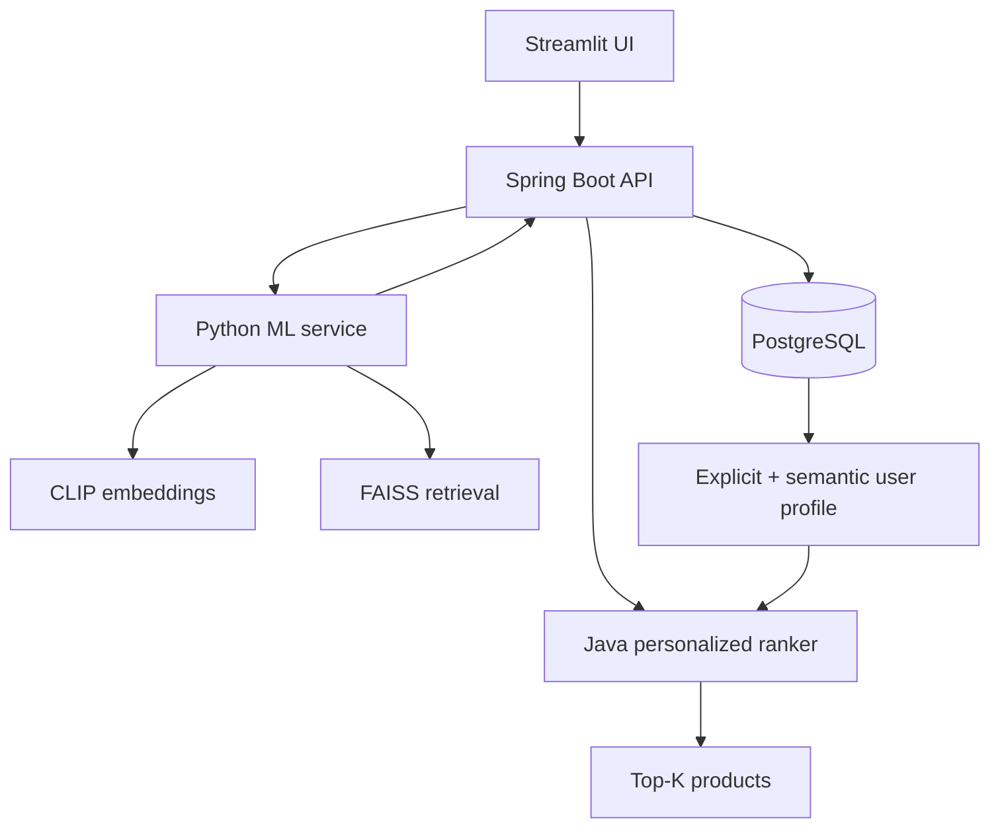

# Personalized Multimodal Product Discovery

This project turns a CLIP + FAISS fashion search prototype into a personalized
product discovery system. Python is a narrow ML service; Spring Boot owns the
application, PostgreSQL data, user profiles, and ranking.

## Architecture



One search follows this path:

1. Streamlit sends the query and active user ID to Spring Boot.
2. Spring Boot asks Python for CLIP/FAISS candidates.
3. Python returns candidate IDs, cosine scores, and canonical product vectors.
4. Spring Boot reads product metadata and the user profile from PostgreSQL.
5. Spring Boot reranks the candidates and returns the final Top-K list.

FAISS binaries are generated locally and excluded from Git. The build script
creates normalized indexes. The Python service also supports the original
unnormalized prototype indexes by normalizing them in memory, so candidate
selection uses cosine similarity. A product's normalized text
catalog vector is always used as its canonical profile vector, including when
the product was found through image search; this keeps user profiles stable.

The final score is:

```text
0.60 × query similarity
+ 0.30 × user embedding similarity
+ 0.10 × metadata preference
```

All weights and the candidate-pool multiplier are configurable. The API also
supports a `CLIP_BASELINE` mode, making A/B evaluation straightforward.

## What is implemented

- CLIP text and image embeddings behind a Python FastAPI ML boundary
- FAISS text and image candidate retrieval
- Spring Boot orchestration and all business logic
- PostgreSQL users, products, interactions, search history, and user profiles
- weighted `VIEW`, `CLICK`, `LIKE`, `SAVE`, and `PURCHASE` signals
- explicit category/color/usage preferences from SQL-backed events
- normalized semantic profiles built from interacted product embeddings
- personalized reranking with score-component explainability
- Streamlit search UI and user-profile dashboard
- Precision@K, Recall@K, and NDCG@K calculation endpoint
- reproducible BM25-vs-CLIP benchmark and personalization ablation study
- Flyway migrations and Docker Compose packaging

## Service boundaries

The Python service exposes only:

| Method | Path | Purpose |
|---|---|---|
| `POST` | `/embed/text` | Return one CLIP text vector |
| `POST` | `/embed/image` | Return one CLIP image vector |
| `POST` | `/retrieve/text` | Return FAISS candidates and vectors |
| `POST` | `/retrieve/image` | Return FAISS candidates and vectors |
| `GET` | `/health` | Report index availability/counts and configured model/device |

Java exposes the product application under `/api`, including users, search,
interactions, profiles, and evaluation. Python does not read user or product
metadata and does not rank personalized results.

## Dataset setup

The large Fashion Product Images dataset is intentionally not committed. Download
the Kaggle `paramaggarwal/fashion-product-images-small` dataset and put:

```text
data/styles.csv
images/<product-id>.jpg
```

in the repository. Install Python 3.11 and the dependencies, then prepare the
catalog and build both indexes from the same row order:

```bash
python -m venv .venv
.venv\Scripts\python.exe -m pip install -r requirements.txt
.venv\Scripts\python.exe scripts/prepare_catalog.py --skip-index-check
.venv\Scripts\python.exe scripts/build_indexes.py
```

Validation removes unreadable images while preserving the original CSV order.
`--skip-index-check` is needed for a fresh checkout because the indexes do not
exist yet. The reference dataset produced 44,419 valid products. Building the
indexes embeds every product description and image; allow substantial time on
CPU and internet access for the first model download. The builder refuses to
overwrite existing indexes. For replacement indexes, use a new output directory.

If you already have the original indexes and matching dataset, run
`python scripts/prepare_catalog.py` without the flag to check row counts.
Equal counts alone do not prove that a reordered catalog matches an old index.
Copy `.env.example` to `.env` when using Docker Compose.

Important: `ml_index_id` is the zero-based validated CSV row position. Configure
Spring Boot to import `data/image_validated.csv`, not the unfiltered
`data/styles.csv`. If validation produces a different count, rebuild both
indexes instead of importing mismatched rows.

The importer recognizes the original dataset headers: `id`,
`productDisplayName`, `articleType`, `baseColour`, `season`, `usage`, and
`gender`. It runs only when `products` is empty.

## Run with Docker Compose

Prerequisites: Docker Desktop, a prepared catalog and locally built indexes
(see Dataset setup), and internet access on the first run for the CLIP model.
Compose packaging has been provided; a full container deployment has not been
validated in the development environment.

```bash
copy .env.example .env
docker compose up --build
```

Then open:

- UI: <http://localhost:8501>
- Java API: <http://localhost:8080/api/users>
- ML API docs: <http://localhost:8000/docs>

The first ML request downloads `openai/clip-vit-base-patch32`; subsequent runs
reuse the Docker volume cache.

## Windows local setup (tested path)

PowerShell and the VS Code terminal are not separate systems: VS Code normally
opens PowerShell inside the editor. Run these commands from the repository root.
Calling the virtual environment's Python executable explicitly also avoids
PowerShell activation-policy problems.

### 1. Prepare Python and the catalog

```powershell
python -m venv .venv
.\.venv\Scripts\python.exe -m pip install -r requirements.txt
.\.venv\Scripts\python.exe scripts\prepare_catalog.py --skip-index-check
.\.venv\Scripts\python.exe scripts\build_indexes.py
```

These commands validate the images, create `data/image_validated.csv`, and build
the text and image indexes. The downloaded CSV is only a product catalog; user
history is created later when users interact with search results.

### 2. Prepare PostgreSQL

Start the PostgreSQL Windows service. In pgAdmin, connect as the PostgreSQL
administrator and run this once (change the password if desired):

```sql
CREATE ROLE product_app WITH LOGIN PASSWORD 'product_app';
CREATE DATABASE product_discovery OWNER product_app;
```

If the database already exists but was created under the `postgres` owner, open
the `product_discovery` database in pgAdmin and run:

```sql
ALTER DATABASE product_discovery OWNER TO product_app;
ALTER SCHEMA public OWNER TO product_app;
GRANT ALL ON SCHEMA public TO product_app;
```

The `product_app` role is the technical database login. It is different from
the end users created on the website.

### 3. Start all three processes

Keep each command running in its own VS Code terminal. A terminal that displays
"started" and does not return to the prompt is serving requests; it is not
stuck.

Terminal 1 — Python ML service on port 8000:

```powershell
.\.venv\Scripts\python.exe -m uvicorn src.api:app --reload --port 8000
```

Terminal 2 — Java API on port 8080:

```powershell
$env:CATALOG_CSV_PATH = (Resolve-Path "data\image_validated.csv")
$env:CATALOG_IMAGES_DIR = (Resolve-Path "images")
Set-Location backend
.\mvnw.cmd spring-boot:run
```

The catalog is imported only when the `products` table is empty. The import is
transactional: if a row fails, the whole import is rolled back rather than
leaving a partial catalog.

Terminal 3 — Streamlit UI on port 8501:

```powershell
Set-Location "C:\path\to\product_search_engine-main"
.\.venv\Scripts\python.exe -m streamlit run src\ui.py
```

Replace the example path with this repository's folder. Open
<http://localhost:8501>. Diagnostics are available at
<http://localhost:8000/health> and <http://localhost:8080/api/users>.
Use `Ctrl+C` in a terminal to stop its service.

### 4. Verify personalization

1. Create or select a user.
2. Search and record several `Like` or `Save` actions on a consistent category
   or color.
3. Repeat the same query with personalization on and off.
4. Compare the order and inspect the User profile tab.

The default database connection is in
`backend/src/main/resources/application.yml`. Override it with `DATABASE_URL`,
`DATABASE_USERNAME`, and `DATABASE_PASSWORD` if needed. Java 17 is required;
the included Maven Wrapper supplies Maven.

## Offline evaluation

Run the complete benchmark from the repository root:

```powershell
.\.venv\Scripts\python.exe scripts\evaluate_offline.py
```

The published run evaluated 44,419 products with the original prototype indexes.
The command uses your local catalog/indexes with a fixed random seed and writes
the detailed inputs, per-example scores, bootstrap confidence intervals,
summary tables, and SVG charts to `evaluation/results/`. Rebuilding indexes
with other model/library versions may change the published numbers. Save new
runs separately with `--output evaluation/new-run` when comparing them.

### Retrieval benchmark

The benchmark contains 72 catalog-grounded queries: 36 use literal catalog
wording and 36 describe the same targets with paraphrases. Relevant items must
match the target article type, color, and gender.

| Query cohort | Method | Precision@10 | Recall@10 | NDCG@10 | MRR |
|---|---:|---:|---:|---:|---:|
| Literal | BM25 | 0.9500 | 0.1743 | 0.9478 | 0.9676 |
| Literal | CLIP | 0.6722 | 0.0995 | 0.6877 | 0.8489 |
| Paraphrased | BM25 | 0.0556 | 0.0102 | 0.0673 | 0.1608 |
| Paraphrased | CLIP | 0.5639 | 0.0860 | 0.5745 | 0.6898 |
| Overall | BM25 | 0.5028 | 0.0923 | 0.5076 | 0.5642 |
| Overall | CLIP | 0.6181 | 0.0928 | 0.6311 | 0.7693 |

Overall, CLIP improved NDCG@10 by 24.34% over BM25 (0.5076 to 0.6311).
The experiment also shows the trade-off instead of hiding it: BM25 is stronger
for literal attribute queries, while CLIP is substantially stronger when the
query uses synonyms and natural phrasing.

### Personalization ablation

Because the source dataset has no real user-event history, this experiment uses
171 deterministic simulated profiles. Each profile contains 10 history items;
those items are excluded from both recommendations and held-out relevance.

| Method | Precision@10 | Recall@10 | NDCG@10 | Hit Rate@10 |
|---|---:|---:|---:|---:|
| Random within candidates | 0.0298 | 0.0024 | 0.0298 | 0.1754 |
| CLIP | 0.0304 | 0.0040 | 0.0316 | 0.1404 |
| CLIP + Metadata | 0.3216 | 0.0520 | 0.3433 | 0.5848 |
| CLIP + Semantic Profile | 0.2813 | 0.0401 | 0.2951 | 0.5848 |
| Full Hybrid | 0.3684 | 0.0640 | 0.4053 | 0.6491 |

The full hybrid reranker increased NDCG@10 from 0.0316 to 0.4053, an absolute
gain of 0.3738 with a paired-bootstrap 95% confidence interval of
[0.3225, 0.4288]. The 500-item candidate pool covered only 12.35% of the full
held-out relevant set on average, identifying candidate generation as the next
quality bottleneck.

These are simulated-user offline results, not an online A/B test. Relevance is
derived from catalog metadata, which favors methods that use the same metadata.
Use the benchmark for reproducible regression testing and architecture
comparison; do not present it as evidence of real-user satisfaction. See the
[generated evaluation report](evaluation/results/REPORT.md) for the full
protocol and confidence intervals.

## Main API examples

Create a user:

```http
POST /api/users
Content-Type: application/json

{"username":"alex"}
```

Personalized text search:

```http
POST /api/search/text
Content-Type: application/json

{"userId":1,"query":"black running shoes","topK":10,"personalized":true}
```

Record a signal (the user profile is rebuilt immediately):

```http
POST /api/interactions
Content-Type: application/json

{"userId":1,"productId":1234,"type":"LIKE"}
```

Calculate offline metrics for one ranked list:

```http
POST /api/evaluation/metrics
Content-Type: application/json

{"rankedProductIds":[10,20,30],"relevantProductIds":[20,40],"k":3}
```

For an experiment, send the same queries once with `personalized:false` and
once with `personalized:true`, collect ranked product IDs, and evaluate each
list against held-out relevant products.

## Tests

From the repository root:

```powershell
.\.venv\Scripts\python.exe -m unittest discover -s tests -v
Set-Location backend
.\mvnw.cmd test
```

The Python tests cover BM25, ranking metrics, normalized FAISS candidate
selection, and stable canonical product vectors. The Java tests cover ranking
metrics and ranking configuration validation.

## Repository layout

```text
backend/                 Spring Boot application and Flyway schema
src/api.py               ML-only FastAPI endpoints
src/pipeline.py          CLIP and FAISS operations
src/ui.py                Streamlit client of the Java API
indexes/                 Index preparation notes (binaries generated locally)
scripts/build_indexes.py Local CLIP/FAISS index builder
notebooks/               Original Colab exploration (outputs cleared)
docker-compose.yml       PostgreSQL + ML + Java + UI
tests/                   Python retrieval regression tests
evaluation/results/      Reproducible benchmark outputs and charts
```

## Public repository contents

The repository includes application code, tests, configuration templates,
historical notebooks and small synthetic evaluation artifacts. Dataset CSVs,
product images, FAISS binaries, model weights, virtual environments, build
output and real `.env` files are excluded. Create local configuration from
`.env.example`; local demo database defaults are not production credentials.

## Acknowledgements

This project extends the original CLIP/FAISS product-search prototype by
Animesh D Chourey. The original MIT copyright notice is retained in
[LICENSE](LICENSE); the Colab notebooks preserve the earlier exploratory work.
The Spring Boot application, PostgreSQL profiles, personalized ranking and
offline evaluation extend that prototype. Dataset and model assets are
distributed separately by their respective providers.
